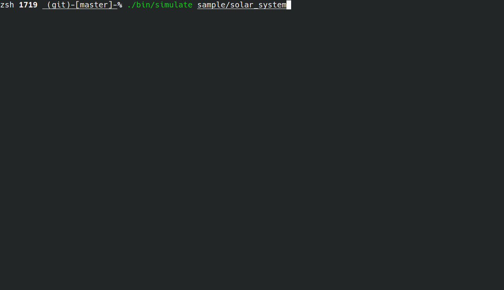

[](./LICENSE)
[](https://arxiv.org/abs/2103.12767)


# GRIT 

<span style="font-size:50em;">**G**ravitational **R**igid-body **I**n**T**egrators, for simulating the coupled dynamics of both spin and orbit.<span>

## Introduction

* This is a package dedicated to the simulation of N gravitationally interacting rigid bodies (instead of point masses).
* Tidal forces and general relativity correction are supported.
* Multiscale splittings boost the simulation speed.
* Multiple schemes with different orders of convergences and splitting strategies are available.
* Don't want rigid body? Each body can be set to be a rigid body or just a point mass.
* Force evaluations can be parallelized.
* Floating-point format can be customized as `float` / `double` / `long double` globally.

## Compile

Following steps here to compile 

1. ``cd src``
2. ``make``
3. Once it is compiled, an executable file named ``simulate`` will be generated in the directory ``bin``.

*If `float` / `long double` is desired, one can manually change the `typedef` of `ld` in `matrix.hpp`.*

## Run 

* Simulate a system with data stored in the directory ``dir``:
```sh
./simulate dir 
```
* Try ``./bin/simulate sample/solar_system`` in the **base directory** of the repository tree to run a short time simulation for the solar system.

## Data

* The data is organized in the unit of directory.
```bash
system_dir
├── init_system.json
├── target_time.json
├── data_in_mat
│   ├── Earth
│   ├── Moon
│   ├── Sun
│   ├── Hamiltonian
│   ├── momentum 
│   └── customize 
├── data_tmp.json
└── current_system.json
```
* Input: "init_system.json", "target_time.json"
* Output: "data_in_mat/*", "current_system.json", "data_tmp.json"

### Input Data

* Necessary files to start a simulation: the initial system ("**init_system.json**") and target time for integration ("**target_time.json**").
* After terminating the program, you may resume your simulation by the same command, the system will resume from the system in the file "current_system.json" with previous data stored in "data_tmp.json", so don't remove those two files if you want to resume.
* To start from the initial system, just remove "current_system.json", then the simulation will start from "init_system.json".

#### init_system.json

* ``system_name``: name of the system.
* ``body`` 
    * ``radius``: the equatorial radius (in km) of the body.
    * ``position``: in AU
    * ``velocity``: in AU/day
    * ``orbital_elements``: (a, e, i, Omega, omega, Mean Anomaly) in (AU, -, rad, rad, rad, rad) with center set at the location of the central object. Instead of specify (position, velocity) as initial conditions of the system, one can specify the orbital elements as an alternative. The search order is ``orbital_elements``, then (``position``, ``velocity``).
    * ``mass``: in M_sun
    * ``time``: in year
    * ``euler_angles``: in rad
    * ``angular_velocity``: in rad/year
* ``current_time``: current time of the system.
* ``parameters``
    * ``step_size``: the step size of the integrator.
    * ``save_interval``: after each ``save_interval`` time, the current data files ("data_in_mat/..." "current_system.json" "data_tmp.json") are updated.
    * ``output_gaps``: the output data are printed every ``output_gaps`` steps. (e.g. If your ``step_size``=1e-3 and ``output_gaps``=1000, then your data will be output every 1e-3*1000 years.)
    * ``potential_order``: ``2``/``4``
    * ``scheme``: ``T2``/``T4``/``T6``/``M42``(default)/``M642``/``K2``
        + ``T2``, ``T4``, ``T6`` are methods of 2nd, 4th and 6th order respectively using classical splitting.
        + ``M42``, ``M642`` are multiscale methods of order (4, 2), (6,4,2) respectively using tailored splitting.
        + ``K2`` is an order (-, 2) method and it is based on the Wisdom-Holman (1991) algorithms algorithm to integrate orbital evolution. This is similar to the method of Touma-Wisdom (1994).
    * ``tide``: ``true``/``false``
    * ``GR``: ``true``/``false``
    * ``coordinates``: ``central``/``Jacobi``
* ``output_format``: you may specify what to include in your output in ``"output_format"``, if it is not specified, then default ``output_format`` will be applied.
    * ``orbital_elements``: ``true``/``false``
    * ``position``: ``true``/``false``
    * ``velocity``: ``true``/``false``
    * ``axis``: ``true``/``false``
    * ``spin``: ``true``/``false``
    * ``obliquity``: ``true``/``false``
    * ``axial_tilt``: ``true``/``false``
    * ``Hamiltonian``: ``true``/``false``
    * ``momentum``: ``true``/``false``
    * ``customize``: ``true``/``false``
        - You may customize your own output data in "src/customize.cpp" using the public variables and functions of the class ``System``. Examples can be found in the current "customize.cpp".
        - If ``customize`` is ``true``, then the customized vector in "src/customize.cpp" will be print in a row at each output time.
* ``tidal_pairs``: {"a": ["b","c"]}, "a" must be the rigid body whose shape change will result in tidal forces.

#### target_time.json

```json
{
    "target_time": 100.0
}
```

* ``target_time``: the target time of the simulation.

#### Examples

1. Example data directory "sample/solar_system": data of the solar system (JPL HORIZONS System J2000).
2. Example data directory "sample/sun_earth_moon": data of sun_earth_moon with tidal forces considered.

##### An Example of "init_system.json"
```json
{ 
    "system_name": "sun_earth_moon",
    "body":[
        { "name":"Sun",     "rigid": false, "mass":1,                          "position": [ 0,                      0,                      0                     ], "velocity": [0,                      0,                      0                     ], "angular_velocity": [0, 0, 9.04209781167040193978e+01 ], "euler_angles": [-4.09105176667470859196e-01, 6.56470691552627150234e+00, 4.56054533546118345296e-01], "radius":695700,   "oblateness":0.000  },
        { "name":"Earth",   "rigid": true,  "mass":3.00329789031572885969E-06, "position": [ -1.685246489174995E-01, 9.687833048228511E-01,  -4.120973411130758E-06], "velocity": [-1.723394583068879E-02, -3.007660259271771E-03, 3.562931614781975E-08 ], "angular_velocity": [0, 0, 2.30159741706839754949e+03 ], "euler_angles": [-4.09105176667470859196e-01, 1.57079632679489655800e+00, 0.00000000000000000000e+00], "radius":6378.137, "oblateness":0.00335},
        { "name":"Moon",    "rigid": false, "mass":3.69566879083389693169E-08, "position": [ -1.706480096344460E-01, 9.671664156658847E-01,  2.402396170914541E-04 ], "velocity": [-1.691006420027502E-02, -3.469659799257778E-03, -9.111637218497984E-07], "angular_velocity": [0, 0, 8.39972693985029473934e+01 ], "euler_angles": [-4.09105176667470875134e-01, 6.22838196866696452384e+00, 4.25162205785818658429e-01], "radius":1738.1,   "oblateness":0.0012 }
    ],
    "current_time": 0.000,
    "parameters":{
        "tide"          : false,
        "GR"            : false,
        "step_size"     : 1e-4,
        "save_interval" : 1,
        "output_gaps"   : 1000,
        "scheme"        : "M42",
        "potential_order": 2
    },
    "output_format": {
        "position": true,
        "velocity": true,
        "Hamiltonian": true,
        "orbital_elements": true,
        "obliquity": true
    }
}
```

### Output Data

* Output data of each body
    + Output data specified in ``output_format`` (e.g. orbital elements data) are stored in the directory of ``data_in_mat``: each file is named after the name of the body.
* Energy and Momentum
    + The *Energy* is store in the file ``data_in_mat/Hamiltonian``. In each line, the order is (time, Energy).
    + The *total linear momentum* and the *total angular momentum* are stored in the file "data_in_mat/momentum". In each line, the order is (time, linear_momentum_x, linear_momentum_y, linear_momentum_z, angular_momentum_x, angular_momentum_y, angular_momentum z).


## License

Copyright © 2021, [Renyi Chen, Gongjie Li, Molei Tao].
Released under the [Apache-2.0 License](LICENSE).

## References

N.B. If you publish the results of calculations using GRIT, please reference the package using

[1] Renyi CHEN, Gongjie LI, and Molei TAO. "GRIT: a package for structure-preserving simulations of gravitationally interacting rigid-bodies." Accepted for publication in ApJ, preprint arXiv:2103.12767 (2021). [[arxiv]](https://arxiv.org/abs/2103.12767)
